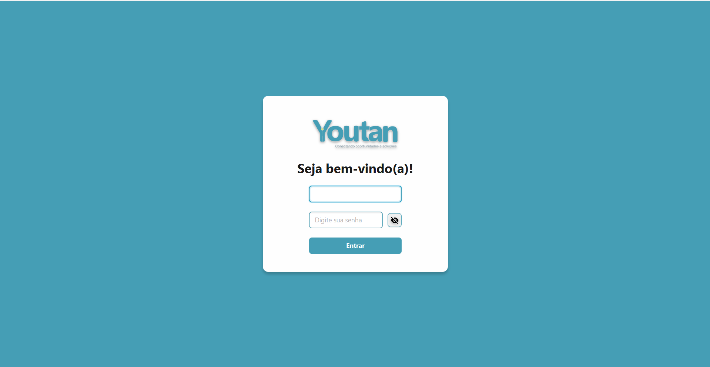

## 📝 BACKLOG SPRINT 2

|   Rank  |   Prioridade   |   User Story   |   Estimativa   |   Sprint   |
|:------:|:-----:|:-----|:------:|:------:|
|1|   Alta   |Como **RH**, quero cadastrar e excluir funcionários para criar seus respectivos PDIs.|   300min   |2|
|2|   Alta   |Como **RH**, quero cadastrar um novo PDI para um colaborador para acompanhar seu desenvolvimento|   240min   |2|
|3|   Média   |Como **RH**, quero registrar objetivos dentro de um PDI para estruturar os planos de crescimento|   180min   |2|
|4|  Média   |Como **RH**, quero adicionar metas e prazos dentro de cada objetivo do PDI para mensurar resultados|   180min   |2|

